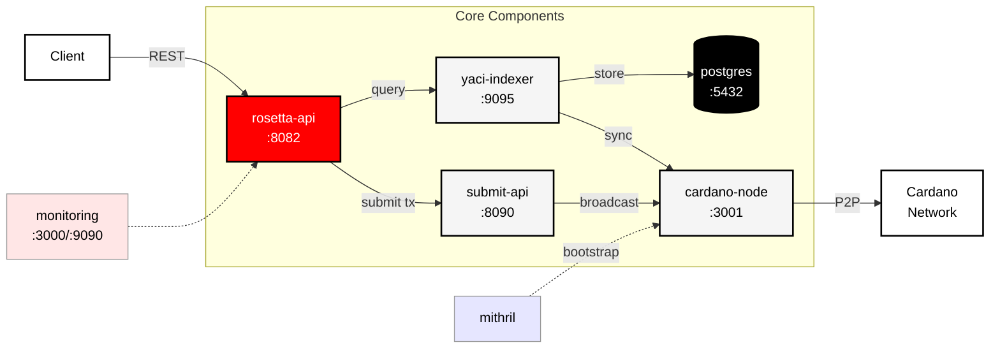

# Cardano Rosetta Java

**High-performance Java implementation of the Mesh API (formerly Rosetta) for Cardano blockchain integration.**

[](https://github.com/cardano-foundation/cardano-rosetta-java/actions/workflows/feature-mvn-build.yaml)
[](https://github.com/cardano-foundation/cardano-rosetta-java/actions/workflows/integration-test.yaml)
[](https://github.com/cardano-foundation/cardano-rosetta-java/releases/latest)
[](https://openjdk.org/projects/jdk/24/)
[](https://docs.cdp.coinbase.com/mesh/docs/welcome)
[](https://github.com/cardano-foundation/cardano-rosetta-java/blob/master/LICENSE)

## Overview

Cardano Rosetta Java provides a production-grade implementation of the [Mesh API specification](https://docs.cdp.coinbase.com/mesh/docs/welcome) (formerly Rosetta) for the Cardano blockchain. Built with Java and powered by [Yaci-Store](https://github.com/bloxbean/yaci-store), it offers significantly lower resource consumption compared to alternative implementations.

### Architecture



### Key Features

- **Mesh API (Rosetta) compliant** for standardized blockchain integration
- **All-in-one Docker Compose deployment** with node, indexer, and API
- **Spent UTXO pruning support** reducing storage by ~40%
- **Offline mode** for secure transaction construction
- **Native asset support** including NFTs and custom tokens
- **Governance operations** for Conway era features (DRep vote delegation, Pool governance vote)
- **SPO operations** for stake pool features (registration, deregistration, retirement, update, etc.)

## Quick Start

> [!IMPORTANT]
> Starting from v1.4.0, [Spent UTXO Pruning](https://cardano-foundation.github.io/cardano-rosetta-java/docs/advanced-configuration/pruning) is **enabled by default** to optimize for exchange operations:
> - Maintains complete current UTXO set and recent history (default: 30 days)
> - Historical block/transaction queries return incomplete data beyond the safety margin
> - Transaction search by hash always works, address search limited to recent history
>
> To keep full history, set `REMOVE_SPENT_UTXOS=false` in your env file.

<details>
<summary><b>Preprod Testnet</b> (~3 hours sync time)</summary>

### Prerequisites
- Docker and Docker Compose
- 4+ CPU cores, 32GB RAM
- 100GB storage (pruning enabled) or 140GB (pruning disabled)

### Steps

1. **Clone and launch**
```bash
git clone https://github.com/cardano-foundation/cardano-rosetta-java.git
cd cardano-rosetta-java

docker compose --env-file .env.docker-compose-preprod \
  --env-file .env.docker-compose-profile-entry-level \
  -f docker-compose.yaml up -d
```

2. **Monitor sync progress**
```bash
# Check sync status
curl -X POST http://localhost:8082/network/status \
  -H "Content-Type: application/json" \
  -d '{"network_identifier": {"blockchain": "cardano", "network": "preprod"}}'

# View logs (merge env files to avoid warnings)
cat .env.docker-compose-preprod .env.docker-compose-profile-entry-level > .env
docker compose logs -f
```

</details>

<details>
<summary><b>Mainnet</b> (48-72 hours sync time with Mithril)</summary>

### Prerequisites
- Docker and Docker Compose
- 8+ CPU cores, 48GB RAM
- 750GB storage (pruning enabled) or 1.3TB (pruning disabled)

### Steps

1. **Clone and launch**
```bash
git clone https://github.com/cardano-foundation/cardano-rosetta-java.git
cd cardano-rosetta-java

docker compose --env-file .env.docker-compose \
  --env-file .env.docker-compose-profile-mid-level \
  -f docker-compose.yaml up -d
```

2. **Monitor sync progress**
```bash
# Check sync status
curl -X POST http://localhost:8082/network/status \
  -H "Content-Type: application/json" \
  -d '{"network_identifier": {"blockchain": "cardano", "network": "mainnet"}}'

# View logs (merge env files to avoid warnings)
cat .env.docker-compose .env.docker-compose-profile-mid-level > .env
docker compose logs -f
```
</details>

> [!NOTE]
> [Mithril snapshots](https://mithril.network/doc/) are used automatically to accelerate initial sync. Full sync times vary based on hardware and network conditions.

## System Requirements

Based on our [hardware profiles](https://cardano-foundation.github.io/cardano-rosetta-java/docs/install-and-deploy/hardware-profiles):

| Profile | CPU | RAM | Storage (Pruning Enabled) | Storage (Pruning Disabled) | Use Case |
|---------|-----|-----|---------------------------|----------------------------|----------|
| **Entry-Level** | 4 cores | 32GB | 100GB (preprod) | 140GB (preprod) | Development & testing |
| **Mid-Level** ⭐ | 8 cores | 48GB | 750GB (mainnet) | 1.3TB (mainnet) | Production (recommended) |
| **Advanced** | 16 cores | 94GB | 750GB (mainnet) | 1.3TB (mainnet) | High-volume exchanges |

## Installation

### Docker Compose (Recommended)

See [Quick Start](#quick-start) above or the [installation documentation](https://cardano-foundation.github.io/cardano-rosetta-java/docs/install-and-deploy/docker).

### Other Methods


> [!WARNING]
> The single Docker image deployment is deprecated. We strongly recommend using Docker Compose deployment for better modularity, resource management, and maintenance.

- **Pre-built all-in-one images**: [DockerHub](https://hub.docker.com/r/cardanofoundation/cardano-rosetta-java)
- **Build from source**: [Documentation](https://cardano-foundation.github.io/cardano-rosetta-java/docs/development/build)

## Configuration

### Key Settings

| Variable | Description | Default |
|----------|-------------|---------|
| `CARDANO_NETWORK` | Network to connect to | `mainnet` |
| `API_SPRING_PROFILES_ACTIVE` | API mode (`online`/`offline`) | `online` |
| `REMOVE_SPENT_UTXOS` | Enable spent UTXO pruning | `true` |
| `REMOVE_SPENT_UTXOS_LAST_BLOCKS_GRACE_COUNT` | Safety margin for pruning (in blocks) | `129600` (~30 days) |
| `API_PORT` | Mesh API port | `8082` |

Check [environment variable reference](https://cardano-foundation.github.io/cardano-rosetta-java/docs/install-and-deploy/env-vars) for details.

## API Usage & Operations

<details>
<summary><b>Common Operations</b></summary>

### Check Network Status
```bash
curl -X POST http://localhost:8082/network/status \
  -H "Content-Type: application/json" \
  -d '{"network_identifier": {"blockchain": "cardano", "network": "mainnet"}}'
```

### Get Account Balance
```bash
curl -X POST http://localhost:8082/account/balance \
  -H "Content-Type: application/json" \
  -d '{
    "network_identifier": {"blockchain": "cardano", "network": "mainnet"},
    "account_identifier": {"address": "addr1..."}
  }'
```

### Submit Transaction
```bash
curl -X POST http://localhost:8082/construction/submit \
  -H "Content-Type: application/json" \
  -d '{
    "network_identifier": {"blockchain": "cardano", "network": "mainnet"},
    "signed_transaction": "..."
  }'
```

</details>

<details>
<summary><b>Monitoring & Troubleshooting</b></summary>

### Health Checks
```bash
# Container status
docker compose ps

# Service logs
docker compose logs -f api
docker compose logs -f yaci-indexer
docker compose logs -f cardano-node
```

### Common Issues

| Symptom | Possible Cause | Action |
|---------|---------------|--------|
| API returns 503 | Services still starting | Wait 2-3 minutes for initialization, check `docker compose logs` |
| Incorrect balances | Node not fully synced | Verify sync with `/network/status`, check `current_block_identifier` vs network tip |
| Transaction submission fails | Invalid CBOR or network mismatch | Verify transaction format, ensure correct network in `network_identifier` |
| High memory usage | Insufficient resources for profile | Switch to lower profile or increase RAM allocation |
| Disk space warnings | Pruning disabled or safety margin too large | Enable pruning (`REMOVE_SPENT_UTXOS=true`) or reduce safety margin |
| Historical queries return incomplete data | Pruning enabled (by design) | Check `oldest_block_identifier` in `/network/status` for fully queryable range |

</details>

## Documentation & Support

- [Full Documentation](https://cardano-foundation.github.io/cardano-rosetta-java/docs/intro)
- [Mesh API Reference](https://docs.cdp.coinbase.com/mesh/docs/api-reference)
- [Cardano Specific API Additions](https://cardano-foundation.github.io/cardano-rosetta-java/docs/core-concepts/cardano-addons)
- [Hardware Profiles](https://cardano-foundation.github.io/cardano-rosetta-java/docs/install-and-deploy/hardware-profiles)
- [GitHub Issues](https://github.com/cardano-foundation/cardano-rosetta-java/issues)
- [GitHub Discussions](https://github.com/cardano-foundation/cardano-rosetta-java/discussions)

## Contributing

See [CONTRIBUTING.md](CONTRIBUTING.md) for development setup and guidelines.

## License

[Apache License 2.0](LICENSE)

---

Built with ❤️ by the [Cardano Foundation](https://cardanofoundation.org)
