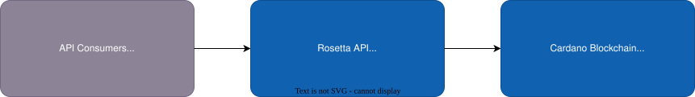
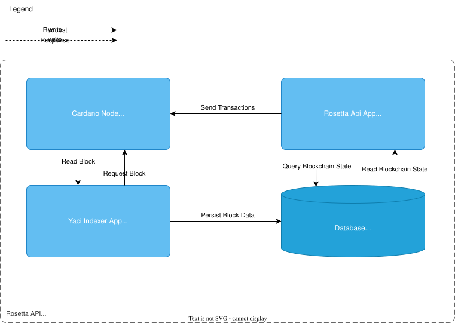

# System Architecture

import Tabs from '@theme/Tabs';
import TabItem from '@theme/TabItem';

:::info
This solution is an implementation of the [Mesh API](https://docs.cloud.coinbase.com/rosetta/docs/welcome) (formerly known as Rosetta API) specification for Cardano Blockchain.
:::

Here and below we use [C4](https://en.wikipedia.org/wiki/C4_model) notation to describe the solution architecture.

_Figure 1: Context Diagram showing system boundaries and external dependencies_

The specific changes in this implementation can be found in [Cardano Specific API Additions](./cardano-addons.md)

:::tip Getting Started
See [Building from Source](../install-and-deploy/build-from-source) to build Docker images locally, or [Docker Compose](../install-and-deploy/docker) to deploy with pre-built images.
:::

The solution provides Construction API (mutation of data) and Data API (read data) according to the Rosetta spec accessible via an REST API that allows you to interact with the Cardano blockchain.

## Implementation Details

The architecture consists of four essential components:

- **[Cardano Node](#cardano-node)**: The foundational layer that maintains blockchain state and connects to the Cardano network
- **[Yaci Indexer App](#yaci-indexer-app)**: Processes and transforms blockchain data into queryable database records
- **[Rosetta API App](#rosetta-api-app)**: Implements the Rosetta specification endpoints for blockchain interaction
- **[Database](#database)**: Stores optimized blockchain data for efficient API access

The Cardano Node serves as the primary source of blockchain data. The Yaci Indexer App fetches data block-by-block from the node, processes it, and stores only the necessary information in the Database, optimized for query performance.

For Data API requests, the Rosetta API App reads this indexed data directly from the Database. For Construction API requests, it uses the Cardano Node to validate and submit transactions to the Cardano network.

_Figure 2: Component Diagram showing internal architecture_

For a complete breakdown of all containers, ports, and their lifecycle, see the [Boot Sequence](../install-and-deploy/boot-sequence#components) page.
