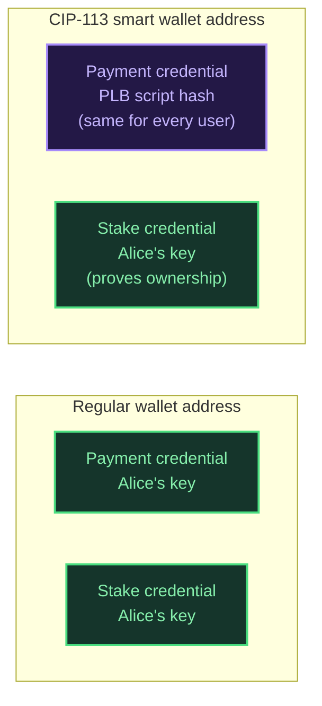
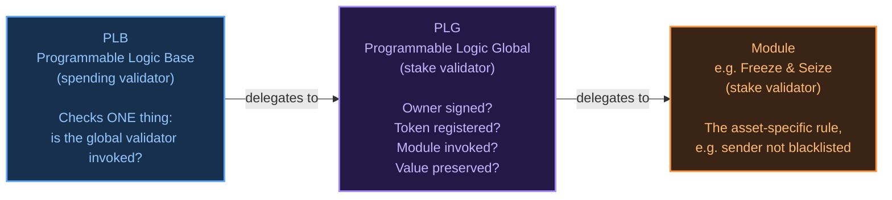

import Tabs from '@theme/Tabs';
import TabItem from '@theme/TabItem';

# Programmable Tokens (CIP-113)

[CIP-113](https://cips.cardano.org/cip/CIP-113) defines a standard for **programmable tokens** on Cardano — native assets whose transfers are validated on-chain against a set of rules (ownership, registration, compliance checks) before they're allowed to move. This page explains the model conceptually. For how Cardano Rosetta Java supports CIP-113 today, see the [Programmable Tokens user guide](/docs/user-guides/programmable-tokens).

:::note Terminology
CIP-113's pluggable rule sets (e.g. a freeze-and-seize policy for regulated assets) are called **modules**. You may see the older term **substandard** in historical material — it was renamed to **module** upstream and should be treated as the same concept.
:::

## Why programmable tokens need a different address model

An ordinary Cardano token is just a native asset: whoever holds a UTxO containing it can spend it, no questions asked. A programmable token needs to intercept every transfer and check things like "is the sender actually the owner?" and "is the sender on a blacklist?" before it moves.

Cardano's UTxO model doesn't have a built-in hook for "run this check whenever this asset moves." CIP-113 works around that with a **shared-custody smart wallet**: instead of living at the user's own address, programmable tokens live at an address built from two parts:

The **payment credential** is a script — the **Programmable Logic Base (PLB)** — and it's the *same script hash for every user* of a given deployment. The **stake credential** is the user's own key, which is what makes each user's smart wallet address unique and proves ownership. Because the payment credential is a script, any attempt to spend from this address must satisfy the PLB validator, which is what gives CIP-113 its hook into every transfer.

## How validation is wired together

A CIP-113 transfer involves up to three validators, each with a narrow job:

- **PLB (Programmable Logic Base)** is the spending validator on the smart wallet address itself. It does almost nothing by design — it just checks that the global validator was also invoked in the same transaction, then gets out of the way.
- **PLG (Programmable Logic Global)** is the real brain: it checks the owner signed, the token is registered, and the appropriate module ran.
- The **module** (e.g. a freeze-and-seize policy) enforces the asset-specific rule — in a freeze-and-seize design, that the sender isn't on a blacklist.

PLG and the module are **stake validators**, not spending validators, which means they're invoked using Cardano's **withdraw-zero pattern**: a "withdrawal" of exactly 0 ADA from their stake address. This runs the validator's logic once per transaction without moving any money. If you inspect a CIP-113 transaction's operations, this is why zero-value withdrawal operations are associated with it on-chain — see the note in the [Staking Operations guide](/docs/user-guides/staking#zero-value-withdrawals) for how Rosetta handles these in its responses.

## What this means for reading chain data

Because a CIP-113 smart wallet is still an ordinary Cardano base address (its payment credential just happens to be a script instead of a key), and a programmable token is still an ordinary native asset at the ledger level, **most Rosetta read endpoints need no CIP-113-specific logic at all** — they already handle base addresses and native-asset token bundles generically. The [Programmable Tokens user guide](/docs/user-guides/programmable-tokens) covers exactly which endpoints are new vs. already work out of the box.

:::important Scope
This page describes how CIP-113 works conceptually, across the wider ecosystem (registry, modules, full transfer construction). Cardano Rosetta Java's current support is narrower than this — see the [user guide](/docs/user-guides/programmable-tokens#phase-1-scope) for exactly what's implemented today.
:::
