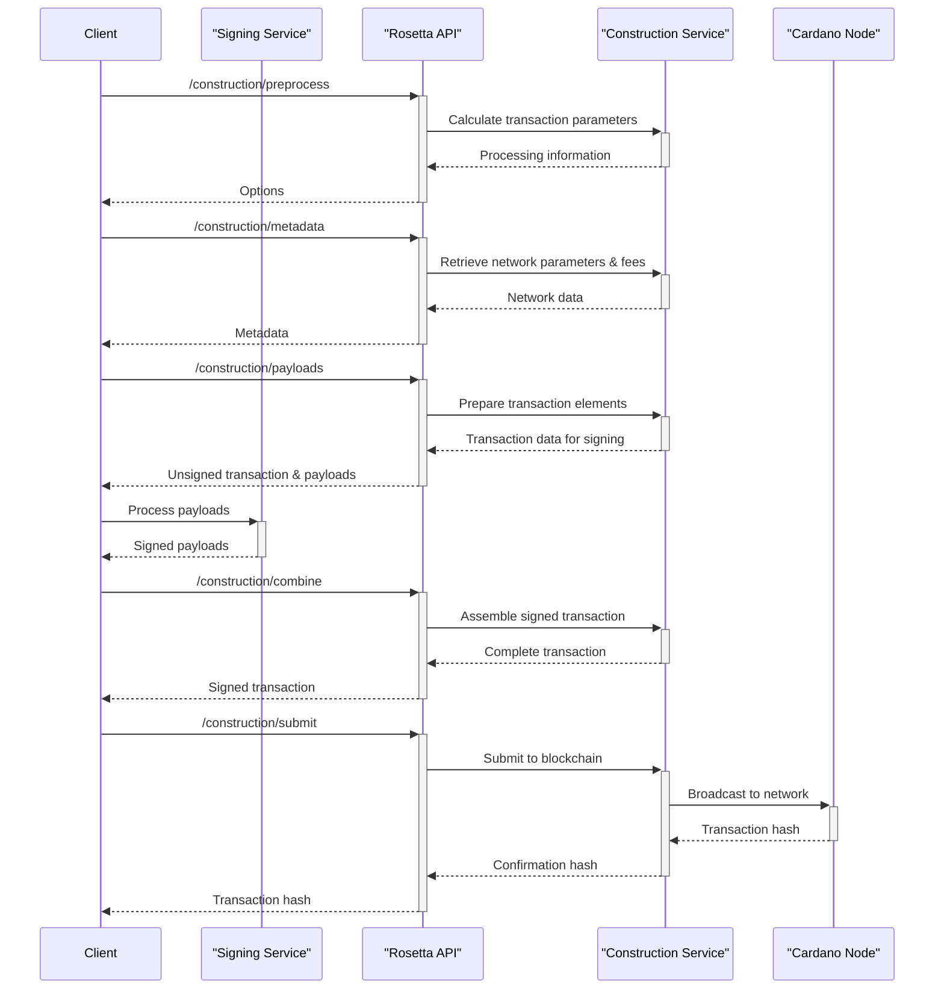

## The Transaction Lifecycle

Creating and submitting a transaction on Cardano using the Mesh API involves several steps and coordinating different components. A key part of this process is the **signing service**, which the client integrates to handle the secure signing of transaction data.

The diagram below walks through the typical sequence of interactions:

As you can see in the diagram, the flow covers everything from preparing the transaction details to the final submission. It also highlights where your custom signing service fits in, taking the unsigned payloads from the API, signing them securely, and returning them to be combined and submitted to the network.
