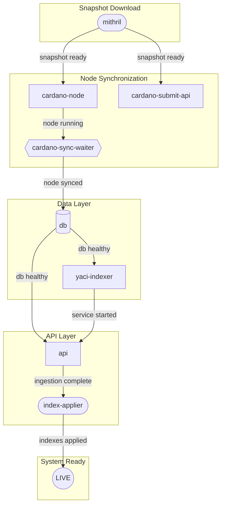
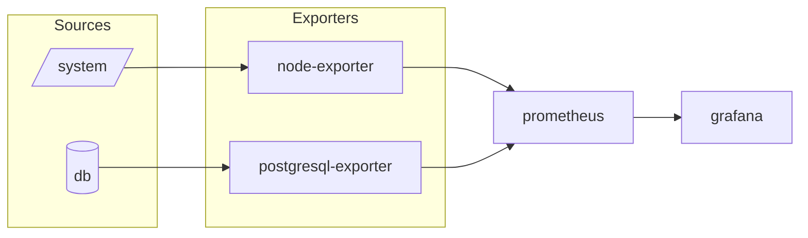
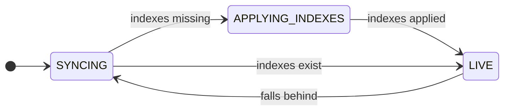

import Tabs from '@theme/Tabs';
import TabItem from '@theme/TabItem';

# Boot Sequence

:::info Version 2.0
This documentation applies to **Rosetta Java v2.0 and later**.
:::

The boot sequence solves three problems:

1. **Blockchain sync is slow**: Syncing from genesis takes days. `mithril` downloads verified snapshots, reducing this to hours.

2. **Ingesting data into a moving target is wasteful**: `yaci-indexer` parses blocks and ingests them into PostgreSQL. If it starts while the node is still syncing, it processes incomplete data. `cardano-sync-waiter` blocks until the node catches up.

3. **Indexes slow initial sync**: Maintaining PostgreSQL indexes while ingesting data is expensive. `index-applier` creates them after ingestion completes.

## Components

### Core

These services are required to run Rosetta Java. One-shot services run once during startup; persistent services run continuously.

| Service | Role | Port | Lifecycle |
|---------|------|------|-----------|
| mithril | Downloads verified blockchain snapshots | - | One-shot: skips if `/node/db` exists |
| cardano-node | Validates and relays blocks | 3001 | Persistent |
| cardano-submit-api | Transaction submission endpoint | 8090 | Persistent |
| cardano-sync-waiter | Blocks until node is synced | - | One-shot: exits when synced |
| db | PostgreSQL database for blockchain data | 5432 | Persistent |
| yaci-indexer | Parses blocks into database tables | 9095 | Persistent |
| api | Rosetta/Mesh API endpoints | 8082 | Persistent |
| index-applier | Adds query optimization after data ingestion | - | One-shot **(New in v2.0)** |

### Monitoring (optional)

These services provide observability into system health and performance. Deploy them alongside the core stack for production environments.

| Service | Role | Port | Lifecycle |
|---------|------|------|-----------|
| prometheus | Metrics collection | 9090 | Persistent |
| grafana | Metrics visualization | 3000 | Persistent |
| postgresql-exporter | Database metrics for Prometheus | 9187 | Persistent |
| node-exporter | System metrics for Prometheus | 9100 | Persistent |

## Startup Order

The core services must start in a specific order. Each service waits for its dependencies before proceeding.



#### Monitoring Stack

The monitoring services run independently from the core boot sequence. `node-exporter` collects host metrics (CPU, RAM, disk) and has no container dependencies. `postgresql-exporter` requires `db` to be healthy before it can scrape database metrics.



## Sync Stages

The `/network/status` endpoint reports system state:



- **SYNCING**: Data in PostgreSQL is behind the blockchain tip. This occurs during initial sync, or when the node or indexer falls behind. Queries may return incomplete data.
- **APPLYING_INDEXES**: Data ingestion is complete. `index-applier` is creating database indexes using `CREATE INDEX CONCURRENTLY`. The API responds but queries may be slow until indexes are ready (~6 hours on mainnet).
- **LIVE**: All data is ingested and all indexes are valid and ready. The system is fully operational for production queries.

<Tabs>
  <TabItem value="mainnet" label="Mainnet" default>

```bash
curl -s http://localhost:8082/network/status \
  -H "Content-Type: application/json" \
  -d '{"network_identifier":{"blockchain":"cardano","network":"mainnet"}}' \
  | jq -r '.sync_status.stage'
```

  </TabItem>
  <TabItem value="preprod" label="Preprod">

```bash
curl -s http://localhost:8082/network/status \
  -H "Content-Type: application/json" \
  -d '{"network_identifier":{"blockchain":"cardano","network":"preprod"}}' \
  | jq -r '.sync_status.stage'
```

  </TabItem>
</Tabs>

## Shared Resources

These volumes must be persisted across container restarts to avoid re-syncing from scratch.

<Tabs>
  <TabItem value="mainnet" label="Mainnet" default>

| Env Var | Host Path | Container Path | Purpose |
|---------|-----------|----------------|---------|
| `CARDANO_NODE_DIR` | `/opt/rosetta-java-mainnet/node_data` | same as host | Node socket and blockchain data |
| `CARDANO_NODE_SOCKET_PATH` | `${CARDANO_NODE_DIR}/node.socket` | same as host | IPC socket for node communication |
| `CARDANO_NODE_DB` | `${CARDANO_NODE_DIR}/db` | same as host | Blockchain ledger |
| `CARDANO_CONFIG` | `./config/node/mainnet` | `/config` | Genesis files, topology |
| `DB_PATH` | `/opt/rosetta-java-mainnet/sql_data` | `/var/lib/postgresql/data` | PostgreSQL data files |
| - | `./api/src/main/resources/config/db-indexes.yaml` | `/config/db-indexes.yaml` | Index definitions for `index-applier` |

  </TabItem>
  <TabItem value="preprod" label="Preprod">

| Env Var | Host Path | Container Path | Purpose |
|---------|-----------|----------------|---------|
| `CARDANO_NODE_DIR` | `/opt/rosetta-java-preprod/node_data` | same as host | Node socket and blockchain data |
| `CARDANO_NODE_SOCKET_PATH` | `${CARDANO_NODE_DIR}/node.socket` | same as host | IPC socket for node communication |
| `CARDANO_NODE_DB` | `${CARDANO_NODE_DIR}/db` | same as host | Blockchain ledger |
| `CARDANO_CONFIG` | `./config/node/preprod` | `/config` | Genesis files, topology |
| `DB_PATH` | `/opt/rosetta-java-preprod/sql_data` | `/var/lib/postgresql/data` | PostgreSQL data files |
| - | `./api/src/main/resources/config/db-indexes.yaml` | `/config/db-indexes.yaml` | Index definitions for `index-applier` |

  </TabItem>
</Tabs>


## Health Checks

Use these methods to verify each service is running and responsive.

| Service | Method | Command |
|---------|--------|---------|
| db | PostgreSQL ready | `pg_isready -U $DB_USER -d $DB_NAME` |
| api | HTTP POST | `curl -X POST .../network/options` |
| api | Sync status | `curl -X POST .../network/status` → check `stage` |
| yaci-indexer | Spring actuator | `curl .../actuator/health` |
| cardano-node | CLI query | `cardano-cli query tip --mainnet` or `--testnet-magic <N>` |
| cardano-submit-api | TCP port | `nc -zv localhost 8090` |
| prometheus | HTTP GET | `curl .../-/healthy` |
| grafana | HTTP GET | `curl .../api/health` |
