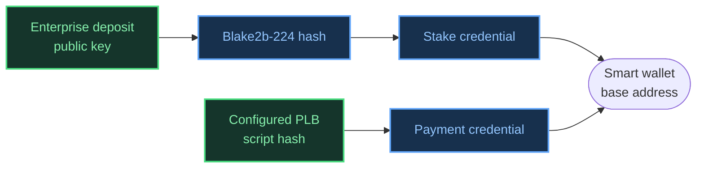

import Tabs from '@theme/Tabs';
import TabItem from '@theme/TabItem';

# Programmable Tokens

Cardano Rosetta Java supports [CIP-113](https://cips.cardano.org/cip/CIP-113) **programmable tokens**: native assets held in a shared-custody **smart wallet** address, whose transfers are validated on-chain. If you're not familiar with the model — the smart wallet address structure, the validator chain, the withdraw-zero pattern — read the [Programmable Tokens core concept](/docs/core-concepts/programmable-tokens) page first. This guide covers what's actually implemented and how to call it.

## Phase 1 scope

Phase 1 supports **one explicitly configured Programmable Logic Base (PLB) script hash per Rosetta network instance** (set via the `CIP113_BASE_SCRIPT_HASH` environment variable). Within that scope:

- ✅ Derive a CIP-113 smart wallet address from a public key (`/construction/derive`)
- ✅ Resolve an existing user address (enterprise or base) to its corresponding smart wallet address (`/call`, `resolve_smart_wallet_addr`)
- ✅ Read balances, UTXOs, blocks, and transactions involving smart wallet addresses and programmable tokens — these already work through the existing Data API endpoints, with no special handling required

Phase 1 does **not**: query the on-chain CIP-113 registry, discover deployments or policies dynamically, validate CIP-113 transaction semantics, or build/sign programmable token transfers. If you need to know whether a given policy is programmable, or build an actual transfer transaction, that's out of scope for this phase.

## Deriving a smart wallet address

`/construction/derive` accepts a new `metadata.address_type: "CIP-113"`. Given an exchange's enterprise deposit public key, it derives the corresponding smart wallet address: payment credential = the configured PLB script hash, stake credential = the Blake2b-224 hash of the supplied public key.



<Tabs>
  <TabItem value="request" label="Request" default>

```json
{
  "network_identifier": {
    "blockchain": "cardano",
    "network": "preprod"
  },
  "public_key": {
    "hex_bytes": "1b400d60aaf34eaf6dcbab9bba46001a23497886cf11066f7846933d30e5ad3f",
    "curve_type": "edwards25519"
  },
  "metadata": {
    "address_type": "CIP-113"
  }
}
```

  </TabItem>
  <TabItem value="response" label="Response">

```json
{
  "account_identifier": {
    "address": "addr_test1zqvca3jpwpvrtd0fvexseqs55em0zg0zkr26hzs7e0qw6w9mgrc6v3au3rqm66mn3kuwke340kfxga82tl7kh2nke8asgpvgzg"
  }
}
```

  </TabItem>
</Tabs>

📚 See also: the [`/construction/derive` entry in the API Reference](/cardano-rosetta-java/api) for the full request/response schema.

:::caution Case-sensitive, and no extra staking credential
`metadata.address_type` must be exactly `"CIP-113"` — `"cip113"` or any other casing is rejected as an invalid address type. Supplying `metadata.staking_credential` alongside `address_type: "CIP-113"` is also rejected (error `5062`) rather than silently ignored, since the stake credential is always derived from the supplied public key.
:::

## Resolving an existing address to its smart wallet

Some exchanges already have an enterprise or base address for a user and need the corresponding CIP-113 smart wallet address without going back to the original public key. The `/call` endpoint's `resolve_smart_wallet_addr` method does this by extracting the user's stake credential from the address you already have:

<Tabs>
  <TabItem value="request" label="Request" default>

```json
{
  "network_identifier": {
    "blockchain": "cardano",
    "network": "preprod"
  },
  "method": "resolve_smart_wallet_addr",
  "parameters": {
    "address": "addr_test1vz75nqeurq7nfgyzmgu4e4emrjqk7qn3jpaf7krzp09vd9qdzamqp"
  }
}
```

  </TabItem>
  <TabItem value="response" label="Response">

```json
{
  "result": {
    "account_identifier": {
      "address": "addr_test1zqvca3jpwpvrtd0fvexseqs55em0zg0zkr26hzs7e0qw6w9mgrc6v3au3rqm66mn3kuwke340kfxga82tl7kh2nke8asgpvgzg"
    }
  },
  "idempotent": true
}
```

  </TabItem>
</Tabs>

`resolve_smart_wallet_addr` accepts enterprise addresses (key payment credential), base addresses (key payment credential, key stake credential), and base addresses whose payment credential already matches the configured PLB — it rejects address types it can't meaningfully resolve (Byron, pointer, reward, or a base/enterprise address with a mismatched script payment credential) with a dedicated, non-retriable error rather than a generic failure. This method is advertised in `/network/options`:

```json
"call_methods": [
  "get_parse_error_blocks",
  "mark_parse_error_block_checked",
  "resolve_smart_wallet_addr"
]
```

📚 See also: the [`/call` entry in the API Reference](/cardano-rosetta-java/api#tag/call/post/call) for the full request/response schema, and the [Handling Unparsed Blocks guide](/docs/advanced-configuration/unparsed_blocks#23-resolve-a-cip-113-smart-wallet-address) for `/call`'s other methods.

## Reading balances and transactions — no special handling needed

A CIP-113 smart wallet address is a normal Cardano base address, and a programmable token is a normal native asset. `/account/balance`, `/account/coins`, `/block`, `/block/transaction`, and `/search/transactions` all pass these straight through the existing indexing and response-building pipeline — there is no CIP-113-specific branch in any of them.

```json
// POST /account/balance
{
  "block_identifier": { "index": 2847593, "hash": "87a3c2b1..." },
  "balances": [
    { "value": "5000000", "currency": { "symbol": "ADA", "decimals": 6 } },
    {
      "value": "1000000",
      "currency": {
        "symbol": "5553444d",
        "decimals": 6,
        "metadata": { "policyId": "ce1ed5614e501ca21c08421523e81a2cae9e8aeff93e07cad6df0334" }
      }
    }
  ]
}
```

The same applies to a programmable token showing up inside a transaction's operations in `/block/transaction` or `/search/transactions` — it renders as an ordinary `tokenBundle` entry on an ordinary `output` operation, at a smart wallet address like any other bech32 address:

```json
{
  "operation_identifier": { "index": 3 },
  "type": "output",
  "status": "success",
  "account": { "address": "addr_test1zp5ccj9...qh8kcm9" },
  "amount": { "value": "1245590", "currency": { "symbol": "ADA", "decimals": 6 } },
  "metadata": {
    "tokenBundle": [
      {
        "policyId": "9cc0471f9cdb97a65efe0e40420b2690bc183a73ebc1c719ac57e181",
        "tokens": [
          { "value": "10000000", "currency": { "symbol": "0014df10526f7365747461555344", "decimals": 0 } }
        ]
      }
    ]
  }
}
```

If you already handle ordinary Cardano addresses and native-asset token bundles, you already support reading programmable token data — there's nothing extra to integrate for these endpoints.

## What's next

Phase 1 covers deriving, resolving, and reading. Building and signing an actual CIP-113 transfer — including collateral handling for the Plutus scripts involved — is planned as follow-on work, not part of this phase.
